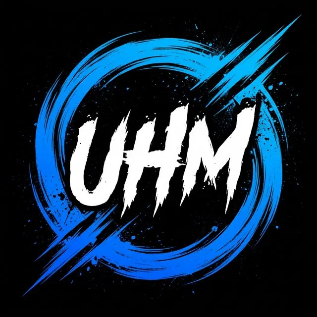

<div align="center">

# 🏁 UHM Pack Installer

### نصب‌کننده‌ی خودکار و حرفه‌ای مودهای گرافیکی UHM برای Assetto Corsa

ساخته‌شده با **Tauri 2 + Rust** · **JavaScript خالص** · **فونت وزیرمتن** · **دوزبانه فارسی/انگلیسی**




</div>

---

### 🖼 پیش‌نمایش رابط کاربری

<p align="center">
  
</p>

---

## 📖 این ابزار چه کاری انجام می‌دهد؟

**UHM Pack Installer** یک برنامه‌ی دسکتاپ برای ویندوز است که فرایند نصب مودهای گرافیکی **UHM** روی بازی **Assetto Corsa** را به‌صورت کاملاً خودکار و مرحله‌به‌مرحله انجام می‌دهد:

- مسیر نصب بازی را تشخیص می‌دهد (دستی یا خودکار از Steam).
- فایل‌های پایه‌ی **CSP** و **PURE** را بررسی می‌کند.
- سطح سیستم (کم / متوسط / بالا / خیلی بالا / اولترا) را از کاربر می‌گیرد.
- مودها را با **پشتیبان‌گیری خودکار (Backup)** نصب می‌کند.
- امکان **حذف/بازگردانی** مودها را از یک صفحه‌ی مدیریت ساده فراهم می‌کند.
- رابط کاربری فارسی و انگلیسی با پشتیبانی کامل RTL/LTR دارد.

> ⚠️ **نکته‌ی مهم:** برنامه «قاب نصب» و «موتور نصب» را کامل پیاده‌سازی کرده، اما **فایل‌های واقعی مودها** (فایل‌های CSP، PURE، فیلترها و …) باید توسط شما داخل پوشه‌ی `src/assets/mod-files` قرار بگیرد. تا وقتی فایلی وجود نداشته باشد، نصب به‌صورت امن با وضعیت **«⚠️ فایل مود موجود نیست»** متوقف می‌شود و برنامه از کار نمی‌افتد.

---

## ✨ امکانات

### 🎨 رابط کاربری و طراحی
- ✅ پنجره‌ی فریم‌لس (Frameless)، گردگوشه و قابل تغییر اندازه
- ✅ تم **شب / روز** با ذخیره‌ی خودکار
- ✅ فونت **Vazirmatn** به‌صورت آفلاین (بدون نیاز به اینترنت)
- ✅ صفحه‌ی Showcase با اسلایدشو و نقطه‌های تعاملی
- ✅ انیمیشن‌های نرم ورود صفحات، Hover و اسلایدشو
- ✅ Toast و Modal سفارشی برای پیام‌ها و تأییدها
- ✅ پشتیبانی کامل RTL (فارسی) و LTR (انگلیسی)

### ⚙️ عملکردی
- ✅ تشخیص خودکار مسیر Steam روی **همه‌ی درایوها** + خواندن `libraryfolders.vdf`
- ✅ اعتبارسنجی مسیر (`acs.exe` یا `assettocorsa.exe` + پوشه‌ی `content`)
- ✅ بررسی وجود **CSP** و **PURE** و تصمیم برای بازنویسی
- ✅ انتخاب ۵ سطح سیستم (Low / Medium / High / VeryHigh / Ultra)
- ✅ نصب خودکار با نوار پیشرفت، گزارش زنده و دکمه‌ی انصراف
- ✅ موتور نصب **ZIP / RAR / CBR** و کپی پوشه‌ی تودرتو
- ✅ بکاپ‌گیری از فایل‌های موجود قبل از بازنویسی
- ✅ مدیریت و حذف مودها با بازگردانی بکاپ
- ✅ مانیفست نصب (`manifest.json`) برای پیگیری وضعیت مودها

### 🔒 امنیت (Tauri)
- ✅ فرانت‌اند هیچ دسترسی مستقیمی به فایل‌سیستم/شبکه ندارد؛ فقط از طریق دستورات `#[tauri::command]` در Rust
- ✅ دسترسی‌ها با **Capabilities** (`src-tauri/capabilities/default.json`) به حداقل محدود شده
- ✅ پل `window.uhm` در `src/js/tauri-bridge.js` (فقط توابع whitelist‌شده)
- ✅ محدودسازی مسیر مقصد داخل پوشه‌ی بازی (`isWithin`)
- ✅ باز کردن لینک خارجی فقط با پروتکل `http/https`
- ✅ افزودن `Content-Security-Policy`

---

## 🛠 پیش‌نیازها

| مورد | نسخه | توضیح |
|---|---|---|
| **Windows** | 10 یا 11 | هدف اصلی نرم‌افزار |
| **Node.js** | 18 یا بالاتر | فقط برای توسعه/بیلد |
| **Rust + VS Build Tools** | stable | فقط برای توسعه/بیلد ([rustup.rs](https://rustup.rs)) |
| **WebView2** | — | روی Win10/11 از قبل نصب است؛ در غیر این صورت نصب‌کننده خودش دانلود می‌کند |
| **Assetto Corsa** | نسخه‌ی Steam | برای نصب مودها |
| **فایل‌های مود UHM** | — | داخل `mod-files/` (ریشه‌ی پروژه) قرار می‌گیرد |

> نکته: اگر فقط می‌خواهید UI را ببینید، می‌توانید بدون نصب Rust از حالت **Browser Preview** استفاده کنید (پایین‌تر توضیح داده شده).

---

## 🚀 نصب و اجرا

### ۱. دریافت پروژه

```bash
git clone https://github.com/aliam664/App.git
cd App
```

> اگر از GitHub استفاده نمی‌کنید، می‌توانید فایل‌های پروژه را دانلود و در یک پوشه استخراج کنید.

### ۲. نصب وابستگی‌ها

```bash
npm install
```

فقط دو بسته‌ی توسعه نصب می‌شود:

- `@tauri-apps/cli` — اجرای dev و ساخت نصب‌کننده
- `linkedom` — فقط برای تست‌های فرانت‌اند

وابستگی‌های هسته (Rust) را Cargo هنگام اولین بیلد می‌گیرد: `zip`, `unrar`, `sysinfo`, `image`, `walkdir`, `serde` و پلاگین‌های Tauri.

### ۳. اجرای برنامه در حالت توسعه

```bash
npm run dev
```

پنجره‌ی UHM Pack Installer با بک‌اند Rust باز می‌شود (اولین اجرا چند دقیقه کامپایل می‌کند).

#### ساخت فایل نصبی:

```bash
npm run build
```

خروجی: `src-tauri/target/release/bundle/nsis/UHM Pack Installer_2.0.0_x64-setup.exe` (حدود ۵–۸ مگابایت). جزئیات در [RELEASE-GUIDE.md](RELEASE-GUIDE.md).

### ۴. پیش‌نمایش رابط کاربری در مرورگر

اگر Rust نصب ندارید یا فقط می‌خواهید ظاهر برنامه را ببینید:

```bash
npm run serve
```

سپس در مرورگر باز کنید:

```
http://localhost:4173
```

این حالت از یک **شبیه‌ساز (Mock)** برای `window.uhm` استفاده می‌کند، پس می‌توانید همه‌ی مراحل ویزارد را بدون نصب واقعی مودها تجربه کنید.

---

## 📦 ساخت فایل نصبی (EXE)

```bash
npm run dist
```

خروجی در پوشه‌ی `dist/` ساخته می‌شود:

```
dist/UHM Pack Installer-1.0.0-x64.exe
```

ویژگی‌های بیلد:

- تارگت: **NSIS** (نصب‌کننده‌ی استاندارد ویندوز)
- امکان انتخاب پوشه‌ی نصب
- ایجاد میان‌بر روی دسکتاپ و منوی استارت
- آیکون برنامه: `src/assets/images/icon.ico`
- فونت‌ها به‌صورت آفلاین همراه app بسته‌بندی می‌شوند
- فایل‌های مود از `asar` خارج می‌شوند (`asarUnpack`)

---

## 🧭 استفاده از برنامه (مراحل ویزارد)

نرم‌افزار به‌صورت یک ویزارد ۵ مرحله‌ای کار می‌کند:

```
شروع (Showcase)
   │
   ▼
① انتخاب مسیر بازی
   │  (مرور دستی / جستجوی خودکار Steam)
   ▼
② بررسی فایل‌های پایه
   │  (CSP / PURE + تصمیم بازنویسی)
   ▼
③ انتخاب سطح سیستم
   │  (کم / متوسط / بالا / خیلی بالا / اولترا)
   ▼
④ نصب خودکار مودها
   │  (نوار پیشرفت + گزارش + انصراف + بکاپ)
   ▼
⑤ صفحه‌ی پایان
   │
   └──> مدیریت مودها (حذف / بازگردانی)
```

### جزئیات هر مرحله

| مرحله | توضیح |
|---|---|
| **شروع** | اسلایدشوی تصاویر مودها + دکمه‌ی «شروع نصب» و در صورت وجود مود نصب‌شده، دکمه‌ی «مدیریت مودها» |
| **انتخاب مسیر** | انتخاب دستی پوشه‌ی بازی یا جستجوی خودکار در همه‌ی درایوها و کتابخانه‌های Steam |
| **بررسی پایه** | تشخیص نصب قبلی CSP و PURE؛ اگر موجود باشند، از کاربر می‌پرسد بازنویسی شود یا حفظ شود |
| **انتخاب سطح** | ۵ کارت با آیکون و توضیح (Low → Ultra)؛ انتخاب با کلیک |
| **نصب** | کپی/اکسترکت هر مود + بکاپ‌گیری از فایل‌های موجود + گزارش زنده |
| **پایان** | نمایش تعداد مود نصب‌شده، سطح و تعداد مودهای بدون فایل |
| **مدیریت** | لیست مودها با تاریخ، سطح، تعداد فایل و دکمه‌ی حذف/بازگردانی |

---

## 📂 محل قرار دادن فایل‌های مودها

هر مود باید داخل پوشه‌ی `src/assets/mod-files/<mod-id>` قرار بگیرد. نرم‌افزار محتویات این پوشه را با حفظ ساختار زیرپوشه‌ها به مسیر مقصد بازی کپی می‌کند.

| مود | پوشه‌ی منبع | مسیر مقصد پیش‌فرض |
|---|---|---|
| **CSP** (Custom Shaders Patch) | `src/assets/mod-files/csp` | ریشه‌ی بازی (`/`) |
| **PURE** | `src/assets/mod-files/pure` | ریشه‌ی بازی (`/`) |
| **PP Filter** | `src/assets/mod-files/ppfilter` | `system/cfg` |
| **Chase Cam** | `src/assets/mod-files/chasecam` | `system/cfg` |
| **HUD** | `src/assets/mod-files/hud` | ریشه‌ی بازی (`/`) |
| **SRP Light** | `src/assets/mod-files/srp` | `extension/config-ext/pure` |
| **Video** | `src/assets/mod-files/video` | `system/cfg` |

مثال ساختار CSP:

```
src/assets/mod-files/csp/
├── extension/
│   ├── config/
│   │   └── data_manifest.ini
│   └── ...
├── system/
│   └── ...
└── ...
```

### پشتیبانی از آرشیو

اگر در فایل تعریف مود `type: "extract"` باشد، به‌جای پوشه می‌توانید فایل‌های زیر را در `src/assets/mod-files/<mod-id>` قرار دهید:

- `.zip`
- `.rar`
- `.cbr`

در این حالت موتور نصب، آرشیو را استخراج و سپس بکاپ‌گیری و نصب را انجام می‌دهد.

---

## 🗺 ساختار پروژه

```
App/
├── src-tauri/                  ← هسته‌ی Rust (Tauri 2)
│   ├── tauri.conf.json         ← پنجره، CSP، باندل NSIS، resources
│   ├── Cargo.toml
│   ├── capabilities/default.json
│   └── src/
│       ├── main.rs / lib.rs    ← ثبت دستورات IPC و راه‌اندازی
│       ├── installer.rs        ← موتور نصب، بکاپ، مانیفست
│       ├── archive.rs          ← ZIP + RAR (با رمز) از طریق crate‌های zip/unrar
│       ├── library.rs          ← تشخیص Steam/AC، libraryfolders.vdf
│       ├── hardware.rs         ← تشخیص CPU/RAM/GPU و پیشنهاد سطح
│       └── preview.rs          ← پیش‌نمایش تصاویر
├── mod-files/                  ← فایل‌های واقعی مودها (به‌عنوان resource باندل می‌شود)
├── docs/build.yml.example      ← ورک‌فلو GitHub Actions (کپی به .github/workflows/)
├── RELEASE-GUIDE.md            ← راهنمای ساخت exe
├── package.json                ← اسکریپت‌ها (dev/build/check)
├── package-lock.json           ← وابستگی‌های قفل‌شده
├── README.md
├── ANALYSIS.md                 ← تحلیل فنی + وضعیت نهایی
├── scripts/
│   ├── check.js                ← بررسی سلامت + اجرای تست‌ها
│   └── serve.js                ← سرور پیش‌نمایش مرورگر
├── src/
│   ├── index.html              ← نقطه‌ی شروع رابط کاربری
│   ├── css/
│   │   ├── base.css            ← تم، فونت، دکمه، Toast، Modal، انیمیشن
│   │   └── pages.css           ← استایل صفحات
│   ├── js/
│   │   ├── tauri-bridge.js     ← پل window.uhm → دستورات Rust (invoke/listen)
│   │   ├── browser-preview.js  ← شبیه‌ساز window.uhm برای مرورگر
│   │   ├── i18n.js             ← ترجمه‌ی متمرکز فارسی/انگلیسی
│   │   ├── utils.js            ← توابع کمکی (escape، Toast، Confirm، تاریخ)
│   │   ├── modConfig.js        ← تعریف ۷ مود + سطوح سیستم
│   │   └── app.js              ← appState، ناوبری با Stack، Bootstrap
│   ├── pages/
│   │   ├── showcase.js         ← صفحه‌ی اصلی + اسلایدشو
│   │   ├── settings.js         ← تنظیمات
│   │   ├── about.js            ← درباره ما
│   │   ├── gamePath.js         ← مرحله ۱: مسیر بازی
│   │   ├── baseModsCheck.js    ← مرحله ۲: بررسی CSP/PURE
│   │   ├── tierSelect.js       ← مرحله ۳: انتخاب سطح
│   │   ├── install.js          ← مرحله ۴: نصب خودکار
│   │   ├── done.js             ← مرحله ۵: پایان
│   │   └── manageMods.js       ← مدیریت/حذف مودها
│   └── assets/
│       ├── fonts/              ← Vazirmatn (Regular/Medium/Bold/ExtraBold/Black)
│       └── images/             ← لوگو، پس‌زمینه، اسکرین‌شات‌ها، سطوح (همه WebP)
├── test/
│   └── renderer.test.js …      ← اسموک تست رندر صفحات، i18n، داده‌ی کتابخانه
└── .gitignore
```

---

## 🧪 تست‌ها و بررسی سلامت

```bash
npm run check
```

این دستور چهار کار انجام می‌دهد:

1. **بررسی سینتکس** همه‌ی فایل‌های JavaScript
2. **بررسی وجود فایل‌های ضروری** (فونت‌ها، آیکون‌ها)
3. **تست واحد موتور نصب** (`test/installer.test.js`)
   - کپی پوشه‌ی تودرتو
   - بکاپ‌گیری و بازگردانی
   - اکسترکت ZIP
   - مود بدون فایل (Missing)
   - محدودسازی مسیر (Path Traversal)
4. **اسموک تست فرانت‌اند** (`test/renderer.test.js`)
   - بارگذاری اسکریپت‌ها بدون خطا
   - رندر همه‌ی صفحات
   - شبیه‌سازی Mock مرورگر برای `npm run serve`

خروجی مورد انتظار:

```
✔ Syntax & assets OK
ALL TESTS PASSED
RENDERER TESTS PASSED
```

---

## 💾 داده‌ها و تنظیمات ذخیره‌شده

برنامه داده‌های زیر را در پوشه‌ی داده‌ی برنامه ذخیره می‌کند:

```
%APPDATA%\com.uhm.packinstaller\
├── settings.json      ← زبان، تم، مسیر بازی
├── manifest.json      ← وضعیت نصب، سطح، تاریخ، لیست فایل‌های هر مود
└── backups\           ← بکاپ فایل‌های قبلی پیش از بازنویسی
```

---

## 🎨 فونت و مراجع

### فونت
این پروژه از فونت **وزیرمتن (Vazirmatn)** استفاده می‌کند که از ریپازیتوری رسمی گیت‌هاب آن دانلود و به‌صورت آفلاین در `src/assets/fonts` باندل شده است.

- **مخزن اصلی:** [github.com/rastikerdar/vazirmatn](https://github.com/rastikerdar/vazirmatn)
- **مجوز:** SIL Open Font License 1.1
- فایل‌های استفاده‌شده:
  - `Vazirmatn-Regular.woff2` (وزن 400)
  - `Vazirmatn-Medium.woff2` (وزن 500)
  - `Vazirmatn-Bold.woff2` (وزن 700)
  - `Vazirmatn-ExtraBold.woff2` (وزن 800)
  - `Vazirmatn-Black.woff2` (وزن 900)

### کتابخانه‌های مرجع

| کتابخانه | نسخه | مخزن / نقش |
|---|---|---|
| [Tauri](https://github.com/tauri-apps/tauri) | 2 | ساخت اپ دسکتاپ (WebView2) |
| [zip](https://crates.io/crates/zip) | 2 | اکسترکت ZIP (با پشتیبانی رمز) |
| [unrar](https://crates.io/crates/unrar) | 0.5 | اکسترکت RAR/CBR (با پشتیبانی رمز) |
| [sysinfo](https://crates.io/crates/sysinfo) | 0.33 | تشخیص سخت‌افزار |
| [Vazirmatn](https://github.com/rastikerdar/vazirmatn) | v33+ | فونت فارسی |

---

## 🛠 عیب‌یابی (Troubleshooting)

### ۱. `npm run dev` خطای `link.exe not found` یا خطای `unrar_sys` می‌دهد
Visual Studio Build Tools با workload «Desktop development with C++» لازم است. بعد از نصب، ترمینال را دوباره باز کنید.

### ۲. برنامه می‌گوید «فایل مود موجود نیست»
فایل‌های مود را در پوشه‌ی صحیح `mod-files/<mod-id>` قرار دهید. ببینید جدول بالا.

### ۳. مسیر دستی را می‌گیرد ولی خطای «acs.exe پیدا نشد» می‌دهد
پوشه‌ی **ریشه‌ی نصب Assetto Corsa** را انتخاب کنید (جایی که `acs.exe` یا `assettocorsa.exe` در آن است)، نه پوشه‌ی `steamapps` یا پوشه‌ی `content`.

### ۴. پنجره‌ی برنامه سفید/خالی است
WebView2 Runtime نصب نیست: https://go.microsoft.com/fwlink/p/?LinkId=2124703

### ۵. نصب RAR کار نمی‌کند
مطمئن شوید آرشیو واقعاً RAR است. آرشیوهای رمزدار پشتیبانی می‌شوند (رمز پرسیده می‌شود)؛ آرشیوهای چندبخشی (Volume) باید همه‌ی بخش‌ها کنار هم باشند.

---

## 🧩 تغییرات اعمال‌شده در این نسخه (Changelog)

- ✅ رفع نشت `setInterval` در اسلایدشو
- ✅ متمرکزسازی ترجمه‌ها در `i18n.js`
- ✅ جایگزینی `alert()` با Toast و Modal
- ✅ تشخیص خودکار مسیر استیم روی همه‌ی درایوها + `libraryfolders.vdf`
- ✅ پذیرش `acs.exe` یا `assettocorsa.exe`
- ✅ محدودسازی URL خارجی به `http/https`
- ✅ ناوبری Stack دار با `goBack`
- ✅ افزودن فونت Vazirmatn به‌صورت آفلاین
- ✅ آیکون‌های برنامه در `src-tauri/icons/`
- ✅ افزودن `.gitignore` و `package-lock.json`
- ✅ افزودن CSP و محدودسازی Capabilities
- ✅ صفحات TierSelect / Install / Done / ManageMods
- ✅ موتور نصب ZIP/RAR + بکاپ/بازگردانی
- ✅ اسکریپت‌های `serve` و `check`
- ✅ تست واحد + تست رندر
- ✅ **v2.0.0:** مهاجرت کامل از Electron به Tauri 2 — حجم نصب‌کننده از ~۸۰ مگ به ~۶ مگ؛ تصاویر به WebP (۱۰ مگ → ۲ مگ)

---

## 🤝 مشارکت (Contributing)

برای مشارکت:

1. یک Fork از مخزن بگیرید.
2. یک برنچ جدید بسازید.
3. کد را تغییر دهید (ترجیحاً با تمام‌کردن تست‌ها):
   ```bash
   npm run check
   ```
4. یک Pull Request باز کنید.
5. در توضیحات، دقیقاً بنویسید چه چیزی تغییر کرده و چرا.

---

## 🗺 نقشه‌ی راه آینده

- [ ] افزودن فایل‌های واقعی مودها به پوشه‌های `mod-files`
- [ ] انتخاب نسخه‌ی PURE و گزینه‌های پیشرفته‌ی کاربر
- [ ] صفحه‌ی تاریخچه‌ی نصب و پشتیبان‌های چند نسخه‌ای
- [ ] امضای کد (Code Signing) برای توزیع Windows
- [ ] به‌روزرسانی خودکار با `tauri-plugin-updater`
- [ ] افزودن صفحه‌ی انتخاب مودها (انتخابی نصب شود یا خیر)

---

## 📜 مجوز

```
LICENSE: UNLICENSED
```

این پروژه برای استفاده‌ی شخصی / تیم UHM ساخته شده است. فایل‌های مود شخص ثالثی که کاربر اضافه می‌کند، تحت مجوزهای خودشان باقی می‌مانند.

---

<div align="center">

**ساخته‌شده با 💙 برای جامعه‌ی Assetto Corsa**

[Telegram](https://t.me/Uhm_009) · [کانال](https://t.me/Uhm_009YTC) · [YouTube](https://youtube.com/@uhm_009)

</div>
